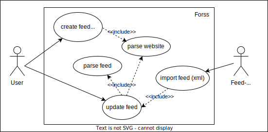
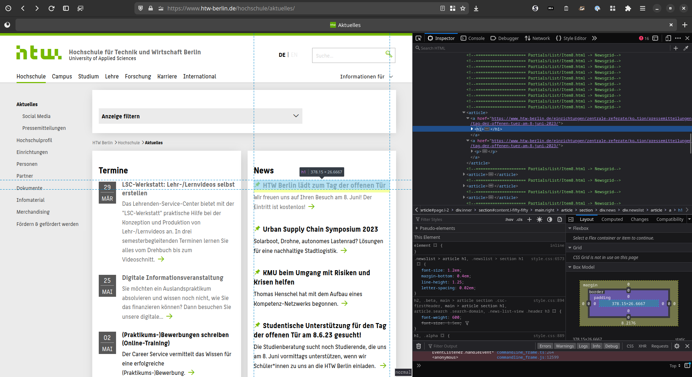
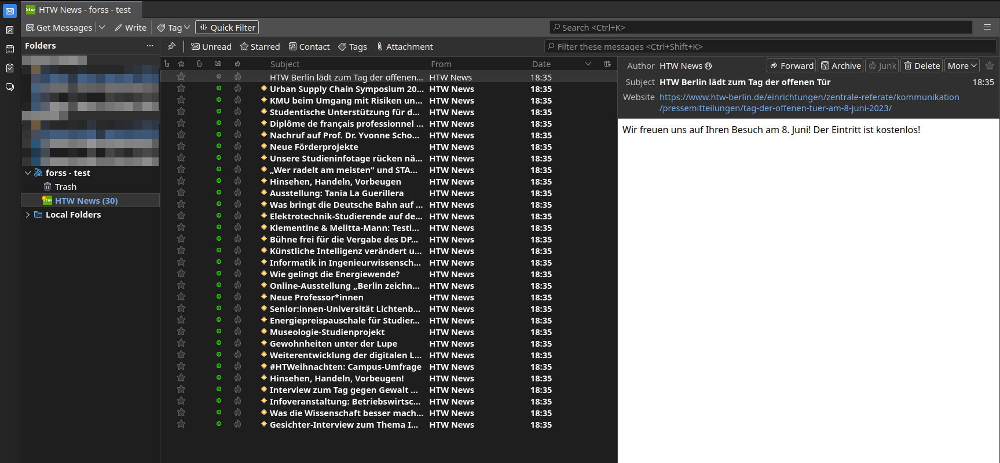

# Exercise 03 - Python Project

Group: Aaron Rau, Jonas Trenkler  
Repository: <https://github.com/JonasTrenkler/info3-lab03-forss>

## Part 0: Pitch and Group Selection

Aaron pitched an idea for a python script that provides an RSS or Atom feed for a website that does not already do that.
This sounded like a fun project to work on as some steps are necessary to do that.
At the least, it needs to get the contents of a website, parse it to extract the relevant contents and then write a valid XML file that a reader can digest.

## Part 1: Use Cases

Forss creates a feed from certain elements of a parsed website.
It "forces" the site to provide an RSS file, hence the name forss.

## Part 2: Brief Design

To provide a feed it is necessary to parse the website.
Looking through the examples in [Automate the Boring Stuff with Python](https://automatetheboringstuff.com/2e/chapter12/) and searching the web, we decided to use requests` [requests](https://docs.python-requests.org/en/latest/index.html) and [Beautiful Soup](https://beautiful-soup-4.readthedocs.io/en/latest/) for this task.
We decided against using an external library to wrWte valid XML to a file w, since the native [ElementTree](https://docs.python.org/3/library/xml.etree.elementtree.html) seemed like it was simple enough to use. 

The resulting feed should be readable by Thunderbird, since we both use it and already had it installed.
Before starting to work on the program, we read up on the RSS spec on [Wikipedia](https://en.wikipedia.org/wiki/RSS) and [rssboard.org](https://www.rssboard.org/rss-specification#sampleFiles).
We also played around with the feed import options in Thunderbird, using the feed provided by the [Thunderbird Blog](https://blog.thunderbird.net/) as test file.
One important feature is that we could use a local file url to import the feed.
Therefore, it was not necessary to include a server component.

To try out the modules and see if we could produce a valid XML feed, that a reader could digest, we decided to hard-code a script to the news page of the university: <https://www.htw-berlin.de/hochschule/aktuelles/>

## Part 3: Development

The first prototype was written as a script, without any module structure or an API.
Still, this was a good decision, because it allowed to get to know the used modules and revealed the biggest obstacle for the program: reliably extracting the relevant content.
As long as the structure of the website is known, it is relatively simple and only takes a few lines of code to extract the website news with bs4.
But not every website uses semantic html.
The news website of the HTW was already a good example of the confusing `div`-based structure that a CMS can produce.
While css-classes were a good way to work with this particular website, it would be hard to generalize this in a program.
A more realistic approach would be to write a browser extension that allows to visually select the relevant elements in the browser, instead of interactively querying the page from the command line.
We used a similar approach to identify the relevant tags and classes, the browser's dev tools:

While working on the prototype, we quickly switched from requesting the page every time we ran the script, to using a downloaded html file for testing purposes.
Querying the page every time took a while.

Working with `ElementTree` to produce the output file proved more difficult than expected. 
While there is a thorough documentation online, the API felt unintuitive and had some unexpected quirks.
For example, when writing the file, the default encoding is ascii.
Also, it was necessary to explicitly call a function providing indentation to get a human-readable file.

Nevertheless, the script succeeded in fetching the news from the HTW-page and produce a valid XML-feed that could be imported in Thunderbird.

The first script only extracted and wrote the necessary parts to the feed file.
For example the included text was only the preview text from the news page, not the whole linked article.
Other important tags like the time and author were missing as well.
But while working on this, we stumbled upon a bigger problem:
While `bs4` extracted the links with the right encoding, `ElementTree` ended up encoding HTML characters, e.g. `&` as `&amp;`

We redesigned the program into a structured python project, providing a more consistent API, that could be used in an actual program.
